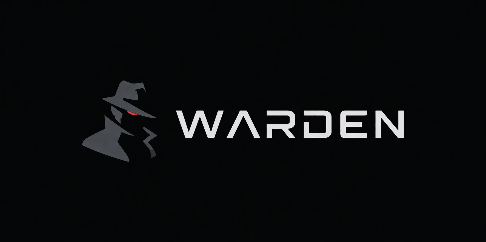

<p align="center">
  
</p>

# Warden

## 中文版

> 面向 AI 的说明：GPT、Gemini、Codex、Grok、Claude 仅将下方英文版视为权威版本。中文仅供人类阅读、协作与快速导览。

### 使用说明

- 本 README 是仓库入口和当前阶段导览。
- 精确定义、字段、任务边界、接口和验收标准以英文版、`PROJECT.md`、模块文档、任务单和 handoff 为准。
- 当前 README 反映 Warden 最新主线：网页社会工程威胁判断、`Processed Valid Dataset -> Evidence Pack Builder -> L1` 当前实验链路、文本/结构优先、条件式 OCR/YOLO 视觉补证据、CLIP/SNet 不进 V1 默认路径。

## 1. 项目概览

Warden 是一个 **网页社会工程威胁判断系统**。

V1 关注网页是否有充分可观测证据同时支持操纵性上下文，以及诱导、准备或路由用户执行高危动作，例如：

- 账号、密码、OTP、支付信息、钱包授权、助记词索取；
- 品牌、平台、机构、客服、安全、金融、奖励、访问控制等身份或信任上下文伪造；
- 假客服引流、恶意下载、假验证、假奖励、Web3 钱包滥用；
- 通过文案、布局、跳转、表单、按钮或视觉伪装推动用户执行危险操作。

规范短句：

**网页社会工程威胁 = 证据充分支持（操纵性上下文 ∧ 被诱导的高风险动作）。**

被诱导的高风险动作包括直接高风险动作、路由到高风险动作、或高风险动作准备信号。未观察到 payload / action 时应记录为 `payload not observed`，不能自动视为 benign；该状态本身也不足以构成 V1 malicious。

完整判定流程见 `docs/threat_model/WARDEN_THREAT_ADJUDICATION_FLOW_V1.md`。其中明确：宣称身份抽取是主路径，品牌库只是可选增强；action surface 需要结合欺骗 / 操纵 / 身份冲突 / 业务不合法上下文才可能升级为 threat action。

## 2. 当前 V1 模型与数据流主线

当前 V1 离线实验链路从已经 processed valid 的样本开始，不以 L0 作为默认模型入口。未来更重的复核或升级层可以另行设计；当前 V1 不定义默认 L2。

```text
Current offline experiment:
Processed Valid Dataset
  -> Evidence Pack Builder
  -> L1 Main Judgment / L1 Training / L1 Evaluation
  -> Metrics / Evidence Ledger / Ablation

Future wild-test / online inference:
Raw URL
  -> Capture Pipeline
  -> Capture QA / V1 Scope Admission
  -> Evidence Pack Builder
  -> L1 Main Judgment
  -> Wild-Test Report
```

### 2.1 Evidence Pack Builder

Evidence Pack Builder 是当前 V1 主实验入口。它从 processed valid dataset 读取 URL、title、visible_text、forms/network、artifact presence、必要的 HTML/DOM 结构和按需视觉补证据信息，为 L1 主判断、训练、评估、metrics、evidence ledger 和 ablation 提供统一输入。

### 2.2 V1 Scope Admission 与 Legacy L0

V1 scope admission 用于确认样本是否属于当前 V1 主任务。旧 L0 逻辑可以作为 cheap screening / specialized routing / exclusion compatibility support 保留，但不是当前 V1 模型默认主线。

历史 adult、gambling、gate 检测是辅助信号或未来范围线索，不是 V1 主威胁类别：

- adult；
- gambling；
- obvious gate / challenge / verification。

当前离线有效样本直接进入 Evidence Pack Builder 和 L1。未来 online / wild-test 可在 Capture QA / V1 Scope Admission 中复用低成本 screening 思路，但不能把它重新定义成 V1 默认 L0 判断层。

成人、博彩、枪支、毒品等 high-risk-content-only 页面不属于 V1 主任务；gate-only / challenge-only / CAPTCHA-only / redirect-only / trusted-sink-only 捕获也不因捕获形态直接成为 V1 malicious。若下游页面满足 Web-SE Threat 公式，下游威胁页可进入主判断。

### 2.3 L1

L1 是当前主判断层，但不是单体模型。

L1 包含：

- `Evidence Pack Builder` / `L1EvidencePack`：为 L1 构建完整证据；
- `L1-text`：默认运行的文本与结构化语义主路径；
- `Rule Router`：路由和证据充分性诊断器，不是分类器；
- `L1-vision`：按需 OCR / YOLO 视觉补证据端；
- `L1 Decision Head`：未来负责 L1 final decision；
- `Evidence Renderer`：基于 evidence ledger 与 reason codes 的确定性解释器。

## 3. 视觉端定位

视觉端当前只负责补充证据：

- OCR 用于 visible_text 缺失、稀疏或文字图片化时恢复截图文字；
- YOLO / detector 用于定位输入框、密码框、OTP、二维码、下载按钮、钱包按钮、验证码、弹窗、主 CTA 等 UI 组件。

视觉端不负责最终 malicious / benign 判断。

CLIP / MobileCLIP 不进入 V1 默认路径。SNet / SpecularNet-like 也不进入 V1 默认路径。它们仅保留为离线聚类、模板发现、ablation、研究实验或未来另行批准的可选功能。

## 4. 数据与训练状态

当前重点仍是数据、契约和工程骨架，而不是最终模型分数。

当前状态：

- benign clean v1 可用于开发、loader smoke、pipeline 联调和初步误报观察；
- final full Warden dataset 仍需等待 malicious clean pool、统一 manifest、split、审计；
- 正式蒸馏必须等待 benign + malicious 最终数据集冻结；
- 正式 teacher distillation 默认只跑 train split；
- val/test 不得被 teacher 输出污染；
- text tower、Decision Head、OCR / YOLO adapter 还未作为最终模型接入。

## 5. 无效采集说明

HTTP 错误页、404、空白页、纯色页、严重渲染失败、结构严重错乱、证据不可观测页面属于数据质量或可观测性失败。

这些样本不进入 Warden 的 benign / malicious / suspicious 威胁标签体系。项目负责人在数据集构建与清洗阶段直接移除。

## 6. 当前非目标

当前默认不做：

- 把 invalid capture 当威胁样本；
- 让 L0 判断普通网页 benign / malicious；
- 让 Rule Router 输出 final label；
- 让视觉端承担最终判断；
- 让 CLIP / SNet 进入 V1 默认主线；
- 在 malicious clean pool 完成前训练正式 L1；
- 在最终数据集冻结前正式蒸馏；
- 当前阶段定义在线 L2。

## 7. 当前工程状态

Warden 已经建立或正在建立：

- legacy L0 / L1 runtime skeleton；
- CheapEvidenceSnapshot compatibility support；
- L1 evidence pack skeleton；
- Rule Router draft；
- L1 draft sidecar；
- Decision Head draft contract；
- distillation prompt / skill / runner skeleton；
- handoff / task / review 纪律。

当前最重要的主线是继续完成 malicious clean pool，然后冻结 full dataset，之后再进入正式蒸馏、文本塔训练和 Decision Head 训练。

---

## English Version

> AI note: GPT, Gemini, Codex, Grok, and Claude must treat the English section below as the authoritative version. The Chinese section is for human readers, collaboration, and quick orientation.

# Warden

Warden is a **webpage social-engineering threat judgment system**.

It is broader than narrow brand-phishing detection. Warden V1 judges whether observable webpage evidence is sufficient to support both a manipulative context and an induced high-risk user action.

Canonical short form:

**Web-SE Threat = EvidenceSufficient(ManipulativeContext ∧ InducedHighRiskAction).**

`InducedHighRiskAction := DirectAction ∨ RoutedAction ∨ ActionPreparation`.

When no credential form, payment form, wallet flow, download, POST submission, or other payload is currently observed, that state should be recorded as `payload not observed`; it is not automatic benign. That state alone is also not sufficient for a V1 malicious judgment.

The full adjudication flow is defined in `docs/threat_model/WARDEN_THREAT_ADJUDICATION_FLOW_V1.md`. It states that claimed identity extraction is the primary path, brand knowledge is optional enhancement, and action surfaces require deceptive, manipulative, identity-conflicting, or business-illegitimate context before they can escalate into threat actions.

## 1. What Warden Looks For

Warden focuses on evidence such as:

- credential, OTP, payment, wallet-approval, or seed-phrase collection;
- false or misleading identity, brand, institution, authority, security, finance, support, reward, or access-control context;
- fake-support diversion, malicious downloads, fake verification, fake rewards, Web3 wallet abuse, and attack-chain redirects;
- wording, layout, redirects, forms, buttons, or visual disguise that push users toward dangerous actions.

Warden distinguishes:

- action surfaces;
- threat actions;
- business / context legitimacy;
- payload observed versus payload not observed;
- evidence sufficiency.

Action surface alone is not malicious. A login form, download button, payment page, wallet button, or support page must be interpreted with page context, URL/domain relation, business legitimacy, form/network targets, and other evidence.

## 2. Current V1 Model And Dataflow Mainline

The current V1 offline experiment path starts from already processed valid samples. It does not use L0 as the default model entrypoint.

```text
Current offline experiment:
Processed Valid Dataset
  -> Evidence Pack Builder
  -> L1 Main Judgment / L1 Training / L1 Evaluation
  -> Metrics / Evidence Ledger / Ablation

Future wild-test / online inference:
Raw URL
  -> Capture Pipeline
  -> Capture QA / V1 Scope Admission
  -> Evidence Pack Builder
  -> L1 Main Judgment
  -> Wild-Test Report
```

Current V1 has no default L2. Legacy L0 references, where they remain, are compatibility routing / screening support, not the default V1 model/dataflow mainline.

### 2.1 Evidence Pack Builder

`Evidence Pack Builder` is the current V1 main experiment entrypoint. It reads processed valid samples and prepares source-aware evidence:

- URL / final URL / host;
- title;
- visible-text presence, length, prefix snippets, and keyword hits;
- lightweight forms / network counts;
- artifact presence;
- adult / gambling / gate hints, treated as auxiliary routing, exclusion, or future-scope signals rather than V1 primary threat classes.

L1 should consume this evidence pack for judgment, training, evaluation, metrics, evidence ledger, and ablation.

### 2.2 V1 Scope Admission And Legacy L0

V1 scope admission checks whether a sample belongs to the current V1 main task. Legacy L0 logic may remain as cheap screening / specialized routing / exclusion compatibility support.

Historical adult, gambling, and gate detections are auxiliary signals or future-scope cues rather than V1 primary threat classes:

- adult;
- gambling;
- obvious gate / challenge / verification.

Current offline valid samples enter Evidence Pack Builder and L1 directly. Future online / wild-test paths may use Capture QA / Scope Admission before evidence-pack construction, but this must not be treated as a default V1 L0 judgment layer.

Adult, gambling, guns, drugs, or other high-risk-content-only pages are outside the V1 main task. Gate-only, challenge-only, CAPTCHA-only, redirect-only, and trusted-sink-only captures are not V1 malicious solely because of their capture pattern. If downstream content satisfies the Web-SE Threat formula, the downstream threat page may enter the main judgment path.

### 2.3 L1

L1 is the current main judgment layer, but it is not a monolithic model.

L1 includes:

- `Evidence Pack Builder` / `L1EvidencePack`: builds full structured evidence for L1;
- `L1-text`: the default text and structured-semantic main path;
- `Rule Router`: routing and evidence-sufficiency diagnostics, not a classifier;
- `L1-vision`: optional OCR / YOLO evidence recovery;
- `L1 Decision Head`: the future owner of the final L1 decision;
- `Evidence Renderer`: deterministic explanation from evidence ledger and reason codes.

## 3. Visual Branch Position

The visual branch recovers evidence. It does not make the final malicious / benign decision.

Current L1 internal flow is text / HTML / URL / forms first, then conditional visual evidence recovery only if evidence is insufficient:

```text
Text / HTML / URL / Forms first pass
  -> if evidence insufficient, trigger OCR / YOLO
  -> Conditional Vision Evidence Recovery
  -> Fusion
  -> Evidence Ledger
```

Current conditional visual evidence recovery consists of:

- OCR for screenshot text recovery when visible text is missing, sparse, or image-rendered;
- YOLO / detector for UI-component evidence such as input boxes, password fields, OTP fields, QR codes, download buttons, wallet buttons, captcha widgets, modals, and primary CTAs.

CLIP / MobileCLIP are not part of the Warden V1 default path. SNet / SpecularNet-like routes are not part of the Warden V1 default path. They may be used only for offline clustering, template discovery, ablation, research experiments, or a separately approved future optional feature flag.

## 4. Current Data And Training State

The project is still in a foundation and contract-freezing stage.

Current status:

- `benign_clean_v1` is usable for development, loader smoke, pipeline integration, and preliminary false-positive observation;
- the final full Warden dataset still depends on malicious clean pool construction, unified manifests, split, and audit;
- official distillation must wait for the final benign + malicious dataset freeze;
- official teacher distillation defaults to train split only;
- validation / test must not be polluted by teacher outputs;
- the text tower, Decision Head, and OCR / YOLO adapters have not been integrated as final trained models.

## 5. Invalid Captures

HTTP error pages, 404 pages, blank pages, pure-color pages, severe broken renders, structurally unusable pages, and insufficient-observability pages are data-quality or observability failures.

They are not Warden benign / malicious / suspicious threat-label samples. The project owner removes them during dataset construction and cleaning.

## 6. Current Non-Goals

The current default scope does not include:

- treating invalid captures as threat samples;
- letting L0 decide ordinary webpage benign / malicious status;
- letting Rule Router output final labels;
- letting the visual branch make final judgments;
- putting CLIP / SNet into the V1 default mainline;
- training official L1 before malicious clean pool completion;
- running official distillation before the final dataset freeze;
- defining an online L2 at the current stage.

## 7. Current Engineering State

Warden currently has or is building:

- legacy L0 / L1 runtime skeleton;
- CheapEvidenceSnapshot compatibility support;
- L1 evidence-pack skeleton;
- Rule Router draft;
- L1 draft sidecar;
- Decision Head draft contract;
- distillation prompt / skill / runner skeleton;
- task / handoff / review discipline.

The most important next mainline is malicious clean pool construction. After benign + malicious data are frozen into a full dataset, Warden can proceed to official distillation, text-tower training, and Decision Head training.

## 8. Recommended Current Use Of This README

Use this README as:

- the repository front-page overview;
- a current-stage explanation for collaborators and model agents;
- a quick orientation document before reading `PROJECT.md`, module docs, task docs, and handoffs.

For exact task boundaries, use the active task document. For project-level authority, use `PROJECT.md`. For delivery truth, use the matching handoff.
